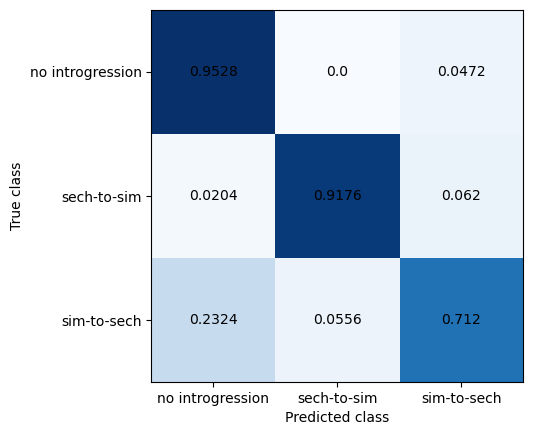

[](LICENSE) [](https://github.com/xin-huang/prml/actions)

# prml

## Introduction

This repository contains a Snakemake workflow designed to reproduce the results for detecting introgressed loci using [pop_gen_cnn](https://github.com/flag0010/pop_gen_cnn/) (Flagel et al. 2019) with a single command. It demonstrates how package managers (e.g., [conda](https://conda.io/projects/conda/en/latest/user-guide/getting-started.html) and [mamba](https://mamba.readthedocs.io/en/latest/)) and workflow managers (e.g., [NextFlow](https://www.nextflow.io/) and [Snakemake](https://snakemake.readthedocs.io/en/stable/)) can be utilized to implement robust machine learning applications for population genetic inference. This approach aligns with the gold standard proposed by Heil et al. (2021), which emphasizes that **the entire analysis should be reproducible with a single command** when applying machine learning to life sciences. This workflow has been tested on Oracle Linux 9 with an AMD EPYC 7272 processor and an NVIDIA Tesla T4 GPU from the Life Science Compute Cluster at the University of Vienna.

## Usage

1. Install [Mambaforge (version: 23.3.1)](https://github.com/conda-forge/miniforge/releases/download/23.3.1-1/Mambaforge-23.3.1-1-Linux-x86_64.sh).

2. Clone this repository:

```
git clone https://github.com/xin-huang/prml
cd prml
```

3. Create the environment:

```
mamba env create -f workflow/envs/env.yaml
```

4. Activate the environment:

```
mamba activate prml
```

5. Run the analysis:

```
snakemake -c 1 --use-conda
```

## Results

After completing the analysis, two plots will be available in the `results/plots` directory, resembling the examples shown below:

- Performance of [the original model](https://github.com/flag0010/pop_gen_cnn/blob/master/introgression/big.data.89.2.acc.mod) from `pop_gen_cnn`:


- Performance of the reproduced model trained from scratch:



## References

Flagel L, et al. 2019. *Mol Biol Evol* **36**: 220–238.

Heil BJ, et al. 2021. *Nat Methods* **18**: 1132–1135.
